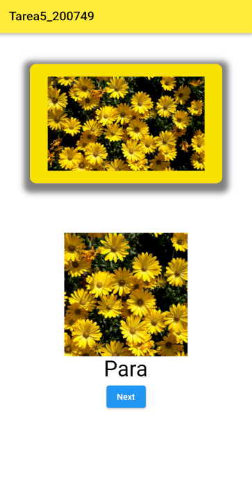
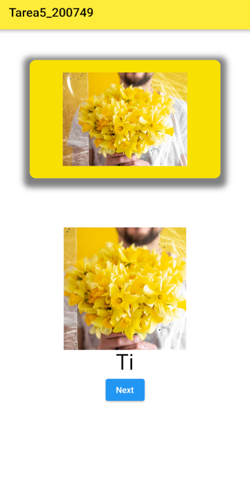

# DMI_TAREA5_200749

  
# Universidad Tecnológica de Xicotepec de Juárez

## Ingeniería en Desarrollo y Gestión de Software

## Desarrollo Movil Integral

## Marco Antonio Rosas Gonzalez
 
## 10° "A"

## Septiempre - Diciembre

## Descripcion:La "Tarea 5" es una emocionante aplicación desarrollada con Flutter que te brinda una experiencia única para explorar tus fotos y recuerdos favoritos. Con un diseño elegante y fácil de usar, esta aplicación te permite navegar a través de tus imágenes con un simple toque de un botón.

  
  

&nbsp;
&nbsp;

&nbsp;
&nbsp;

 
 
